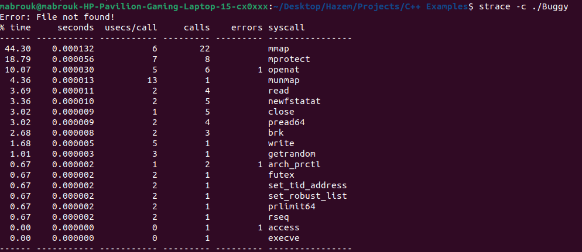

# Task 1 :Buggy app

## Overview
This project contains a C++ program that attempts to read a file sample.txt and if that file is not found the program prints an error message and exits.

## the Problem in code
The code fails to open sample.txt resulting in the error message: Error: File not found!

## the Debugging Steps to Solution

1. **Compile the Code**  
   ```sh
   g++ -g buggy_app.cpp -o Buggy
   ```

2. **Run the code using strace -c**
   ```sh
   strace -c ./Buggy
   ```
   


you will find that error is in openat sys call


3. **Run the code strace to identify reason of error **
   ```sh
   strace  ./Buggy
   ```
   


you will find that error is in openat is as the file given to open doesnt exist

## Solution
create a file named sample.txt in the same directory as buggy_app.cpp:
